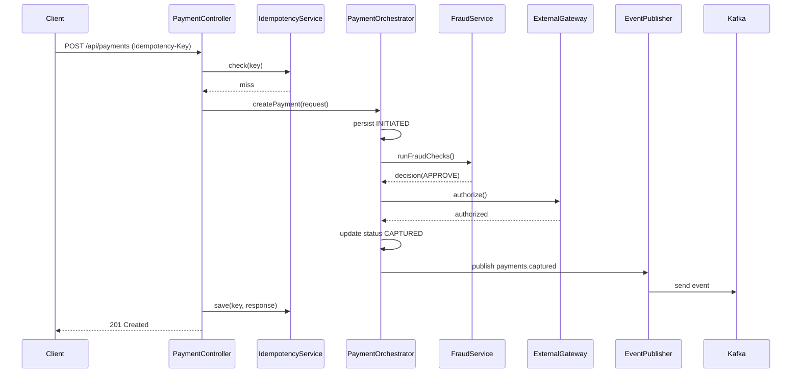

# Payment Processing Engine – Architecture Overview

## 1. Problem Definition & Scope
A modular-monolith Spring Boot service that exposes secure APIs to create, authorize, capture, and manage payments while running fraud checks, enforcing idempotency, and emitting lifecycle events for downstream systems (ledger, notifications, reporting).

## 2. High-Level System Architecture
- **API Layer**: REST controllers under `/api/payments`, `/api/auth`, `/api/admin` secured via JWT.
- **Application Layer**: Orchestration, business rules, idempotency management, fraud scoring, and event publishing.
- **Domain Layer**: JPA entities and repositories for payments, payment methods, events, fraud checks, and idempotency keys.
- **Infrastructure**:
  - **Postgres** for durable storage of payments and audit trails.
  - **Redis** for idempotency caches and short-lived distributed locks.
  - **Kafka** for internal events (`payments.created`, `payments.authorized`, `payments.captured`, `payments.failed`, optional DLQ and fraud topics).
  - **Docker Compose** to provision infra locally.
- **Security**: Spring Security + JWT with roles `ROLE_USER` and `ROLE_ADMIN`.
- **Modularity**: Packaged by feature (controllers/services/repositories) to enable future extraction into microservices.

## 3. Component Responsibilities
- **PaymentController/AdminController**: Validate requests, enforce idempotency headers, and surface DTO responses.
- **PaymentService**: CRUD for payments, payment methods, and events.
- **PaymentOrchestrator**: Drives lifecycle: create → fraud → authorize → capture → publish.
- **FraudService**: Applies rules and stores `FraudCheck` decisions.
- **IdempotencyService**: Checks and stores idempotency keys in Redis (fallback to Postgres) with TTL.
- **EventPublisher / PaymentEventProducer**: Wraps `KafkaTemplate` to emit JSON events and handle retries.
- **PaymentEventConsumer**: Sample consumer to demonstrate retry/DLQ wiring.

## 4. Data Model (JPA Entities)
- **Payment**: `id (UUID)`, `externalId`, `amount`, `currency`, `status (INITIATED|AUTHORIZED|CAPTURED|FAILED|CANCELLED)`, `methodType`, `customerId`, timestamps, `failureReason`.
- **PaymentMethod**: FK to payment; supports card and bank details (masked values only).
- **PaymentEvent**: Audit log of lifecycle events with `payloadJson`.
- **FraudCheck**: Score + decision (`APPROVE|REVIEW|DECLINE`) with reason.
- **IdempotencyKey**: `key`, `requestHash`, `responseBody`, `status`, timestamps/expiry.

## 5. Database Schema (Postgres)
Tables: `payments`, `payment_methods`, `payment_events`, `fraud_checks`, `idempotency_keys`, `users` (demo auth). JPA can autogenerate via `ddl-auto=update`; production should use migrations.

## 6. Kafka Topics & Message Contracts
- Topics: `payments.created`, `payments.authorized`, `payments.captured`, `payments.failed`, optional `payments.fraud-flagged`, `payments.dlq`.
- Payload envelope example:
```json
{
  "eventId": "uuid",
  "eventType": "PAYMENT_CREATED",
  "paymentId": "uuid",
  "externalId": "merchant-12345",
  "amount": 120.50,
  "currency": "USD",
  "status": "INITIATED",
  "timestamp": "2025-11-29T12:34:56Z"
}
```
- Producers should include headers for tracing (`trace-id`, `correlation-id`) and schema versioning.

## 7. Idempotency Strategy
1. Client sends `Idempotency-Key` header on write APIs (e.g., POST `/api/payments`).
2. `IdempotencyService` checks Redis for the key. If present, return cached response.
3. If absent, process request inside a transaction.
4. On success, persist the response + request hash with TTL (24h) in Redis and durable copy in Postgres.
5. Optionally use short-lived Redis locks keyed by `Idempotency-Key` to avoid concurrent inflight duplicates.

## 8. Retry & DLQ
- **Internal retries** for transient gateway errors via `@Retryable` with backoff.
- **Kafka retries** configured on consumers; after N failures route to `payments.dlq` for inspection.
- **Outbox pattern** (future): Write events to DB and relay to Kafka to guarantee at-least-once delivery.

## 9. Security Model
- JWT-authenticated requests with a `Bearer` token.
- Custom `JwtAuthenticationFilter` extracts claims; roles gate admin endpoints.
- Sensitive fields (card numbers) are not logged; only masked values stored.

## 10. Sequence Diagram (Mermaid)


## 11. Operational Notes
- Use Docker Compose to start Postgres, Kafka/ZooKeeper, and Redis locally.
- Expose health endpoints via Spring Boot Actuator.
- Add structured logging + correlation IDs; future work includes metrics/tracing.
